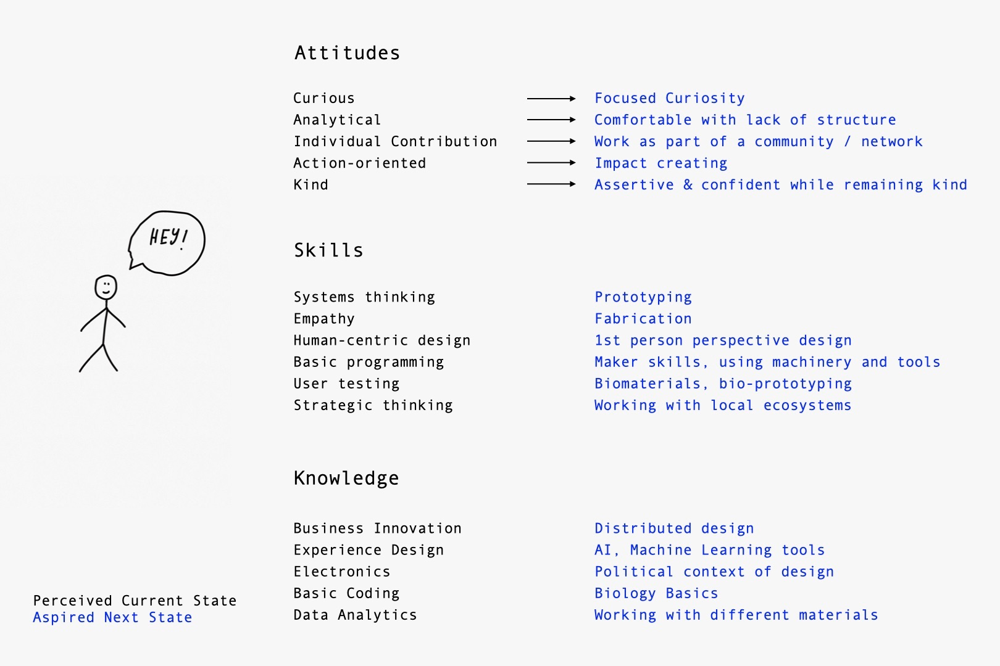
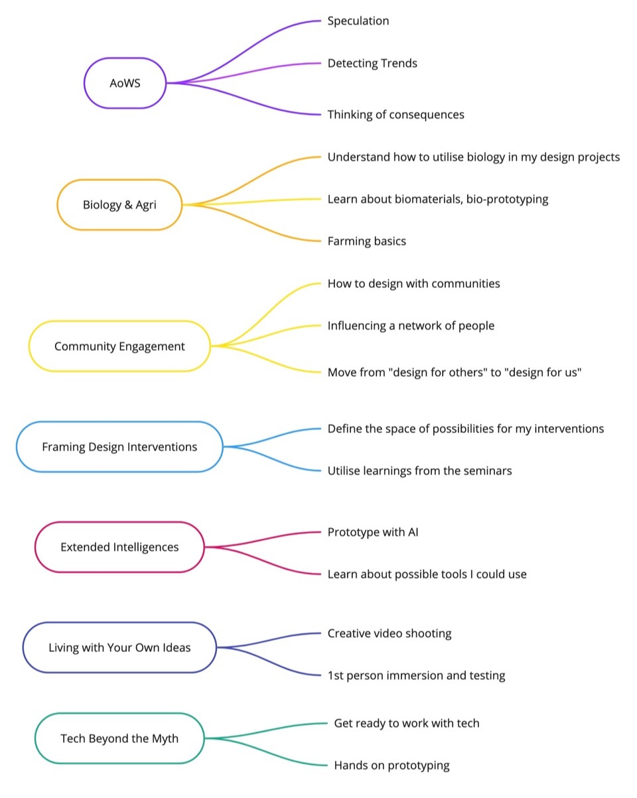

---
hide:
    - toc
---

# Bootcamp

## MY FIGHT

I love technology. I used to love it, to be exact. I remember the first walkman I had and the impact it did in my life through recording and exchanging cassettes: It elevated my life quality in a way I couldn’t have imagined, provided a new way to express myself, and connected me with my friends in a way that wasn't possible before. All these led me to choose to study engineering in electronics, thinking that I would be designing and producing such products, and help people improve their lives in ways they wouldn’t even be able imagine.

Then I broke up with technology. Somewhere along the road, something went very wrong, that technology started being a threat: It started manipulating us, monetising us and using our data against us. It became a tool of consumerism that nothing but profits started to matter. What promised to connect us, started disconnecting us. And so on, and on.

Despite these bitter feelings I've inside, when I think about it, I feel that technology is still humanity's best bet to solve some of the huge issues we have: To bring back the health of our planet, to create more equality, to elevate the potential of each of us, or to create enjoyable moments that connect us.

Doing that, is in the scope of the designers work. It's designers that needs to have certain values, and shape technologies in such ways to make these possible.
So the question is: How can we design things, products or interventions in a way that they don’t exploit neither humans, nor the nature; but they actually elevate their well-being.

In summary, have can we make technology again a source of inspiration, hope and positive change?

That is my fight.

## REFLECTION

## DEVELOPMENT PLAN

