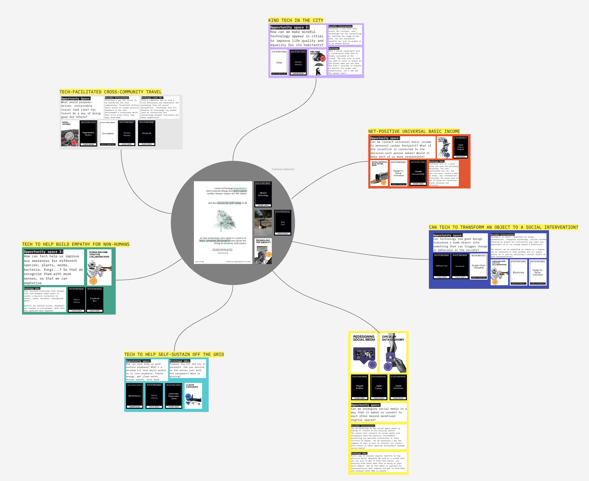
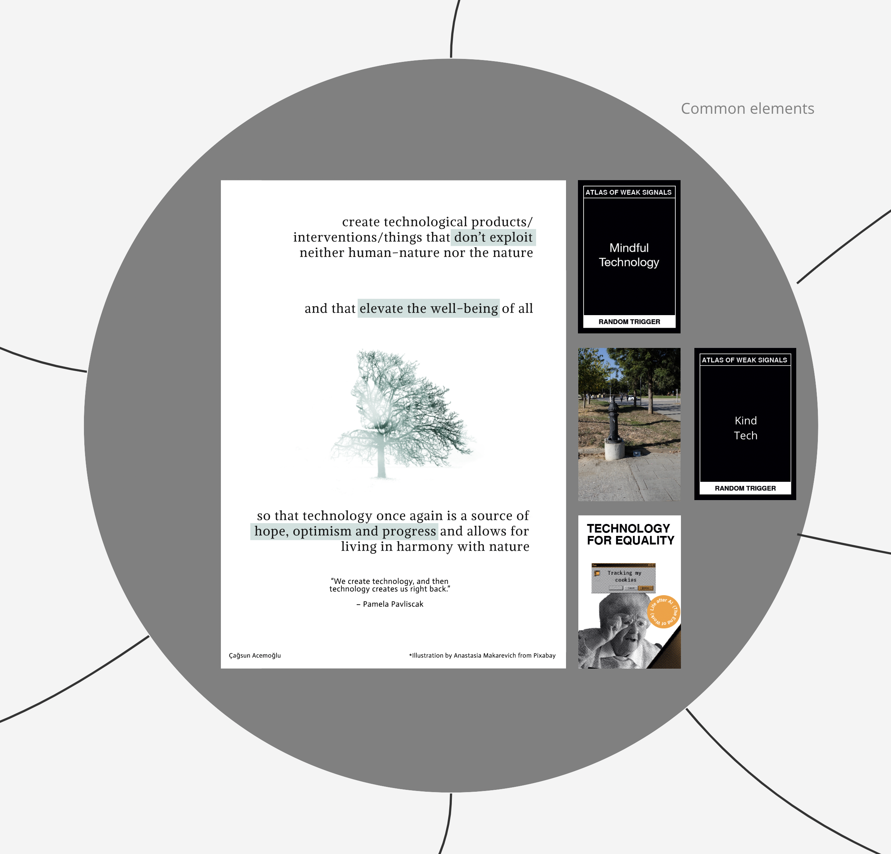

---
hide:
    - toc
---

# Atlas of Weak Signals

Technology has been central in my life: It shaped me as a child, helped me get through my adolescence and shaped my an identity as I moved to adulthood. As surfaced in my “fight” poster; I’ve been bitterly observing how technology transformed to being perceived as a threat to the health of individuals and societies.

The main question I’d like to explore - as described in my fight- is: How can we make tech a source of optimism, kindness and progress for the well-being of all species? To that end, I chose some weak signals and trigger cards that I’m willing to explore, and I’ve ideated some interventions as initial ideas to give some direction to this broad field I’m inclined to work in.

My idea is to work on some of the following opportunity areas -possibly by drifting serially- to explore if/how tech can help transform the status quo in these spaces and create positive impact that would not be possible without it. Some of these interventions depend less on tech than others, which is okay. Technology is such a broad term that one way or another will play a role in design, creation or distribution of these ideas. 

While I’ve placed technology in the centre, I must mention that the main goal of these projects in not “technology for technology’s sake”. My goal is to work on projects that create well-being and harmony for people and the rest of nature: Mindful, ethical and kindly designed technology is just the medium through which I intend to work towards that goal.

With that said, it should not be a surprise that the cards “Mindful Technology”, “Kind Tech’ and “Technology for Equality” form the common ground for my design space. 

The intersection of this common ground with other cards create the following opportunity spaces that I can possibly work on in my projects:

<ul>
    <li>
        <a href="#img1">1 - Can we reimagine social media to create physical connections that get us out of monetised digital spaces?</a>
    </li>
    <li>
        <a href="#img2">2 - Can revamping an object with biomaterials, great design and technology induce behaviour change in a positive way?</a>
    </li>
    <li>
        <a href="#img3">3 - Can we make connect universal basic wage possible by connecting it to personal carbon emissions?</a>
    </li>
    <li>
        <a href="#img4">4 - How can technology display a kind presence in our cities? Can tech be used for an alternative way of sharing beyond economic gains?</a>
    </li>
    <li>
        <a href="#img5">5 - Can we imagine a new way of travelling in which our trips contribute to local progress towards a more regenerative and sustainable future?</a>
    </li>
    <li>
        <a href="#img6">6 - Can technology help create empathy for non-humans? </a>
    </li>
    <li>
        <a href="#img7">7 - How much tech does it take to be self-sustaining and living off the grid?</a>
    </li>
</ul>

## Can we reimagine social media to create physical connections that get us out of monetised digital spaces?

## Can revamping an object with biomaterials, great design and technology induce behaviour change in a positive way?

## Can we make connect universal basic wage possible by connecting it to personal carbon emissions?

## How can technology display a kind presence in our cities? Can tech be used for an alternative way of sharing beyond economic gains?

## Can we imagine a new way of travelling in which our trips contribute to local progress towards a more regenerative and sustainable future?

## Can technology help create empathy for non-humans?

## How much tech does it take to be self-sustaining and living off the grid?

<iframe width="768" height="432" src="https://miro.com/app/live-embed/uXjVPOjTQbE=/?moveToViewport=-756,-833,1355,902&embedId=134823342494" frameborder="0" scrolling="no" allowfullscreen></iframe>