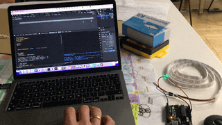

# Blender as an interface

In this class, we learned about interacting with Blender using Python, which was very interesting.

Firstly, we learned about manipulating a model through code, which appeared to be a powerful way to design 3D models programmatically.

Next, we moved on to interacting with external hardware, such as a mobile phone, and later an Arduino device like our feather boards. It took me some time to make the example work due to my inability to install the serial library on Python that Blender installs. Apparently, Blender installs its Python library on Mac, and I couldn't figure out how to install a library inside that one. However, it was as simple as downloading the library, moving the code into the Python folder inside Blender, and importing it through the Python terminal inside Blender.

Reflecting on these possibilities, when I was studying electronics engineering in college (2005-2010), it was not so straightforward to connect hardware and develop interfaces for them through computers. You needed to find either some drivers that microcontroller manufacturers provided in their software kits or write one yourself, which I never did because it was a very tedious task.

That's why it's almost mind-blowing to me that a modeling software like Blender has the tools to communicate with hardware such as Arduino, which can be controlled through a 3D model, such as the 3D model of a switch as we saw in class. I need to take some time to digest what possibilities this opens in conjunction with all the other technologies we've seen this year.

Here's my LED strip working at the end of class, which made me very happy. However, now I need to understand the code.

