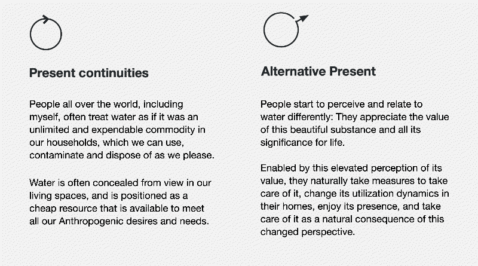

# Design Studio - Role in Alternative Present

## My role in this alternative present:

My role as a designer is to design interventions to inspires this change of perception. In this context, to design means: Coming up with intervention ideas, involving others, empowering them, facilitating the process to bring these ideas to the world by situating them in the right places and exposing them to people in a meaningful way.

Through this work, I have realized that there is a gold mine of possibilities in working with water. There is an opportunity to extend the maker mindset to waterworks. In maker spaces, most tools, materials, and machines related to water do not exist. It is also a lot of fun to work with water due to the physics surrounding it, its relationship with other materials, and its beauty.

It is a rich playground that allows for games, art, functional prototypes, and more. By continuing to do projects in this space, I believe many others can be inspired, ultimately contributing to the alternative future that I strive to promote.